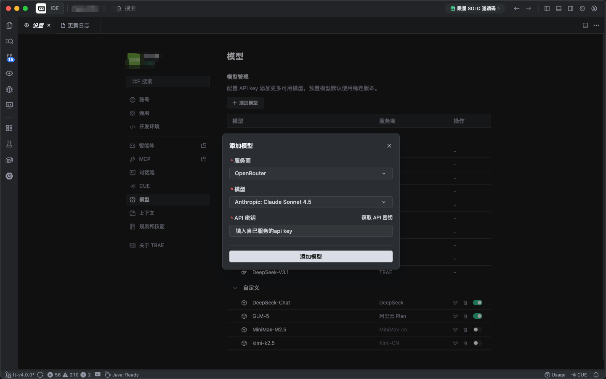
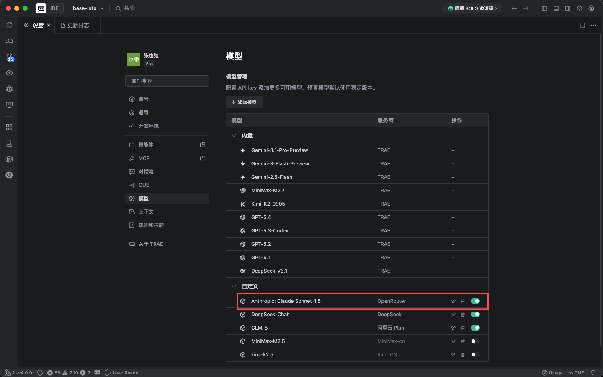
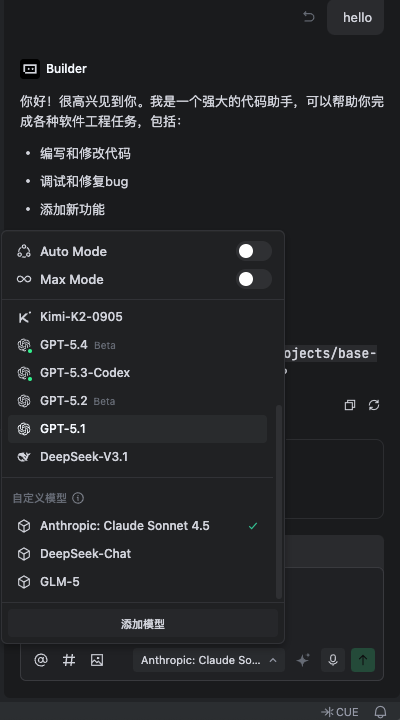

# Trae Proxy

让 Trae 接入任意 Anthropic 或 OpenAI 兼容的自定义模型端点。单二进制，零依赖，跨平台，一键启动。

**支持的上游类型：**
- 各类 Claude 中转站（sub2api、one-api 等）
- 支持 Anthropic Messages API 的云服务（讯飞星火、京东云等）
- 自建的 Anthropic 协议兼容服务
- **OpenAI-compatible 服务**（openrouter.ai 真实端点、LM Studio、Ollama、vLLM 等）

## 更新计划

- 支持自动写入trae配置，实现一键安装

## 命令总览

| 命令 | 说明 | 常用标志 |
|---|---|---|
| `init` | 生成 CA、安装系统信任、写默认配置文件 | — |
| `start` | 启动代理（写入 hosts + 监听 443） | `-d` 后台，`--upstream`，`--listen`，`--config`，`-l`/`--log-level`，`--log-body` |
| `stop` | 停止守护进程并移除 hosts 条目 | — |
| `restart` | 重启守护进程并重新加载配置（未运行时直接以 daemon 模式启动） | 同 `start`（不含 `-d`） |
| `status` | 显示 hosts / 守护进程 / 上游 / 模型映射数 | — |
| `update` | 从 GitHub Releases 自更新（macOS/Linux） | `--version`，`--force` |
| `uninstall` | 移除 CA 信任、hosts 条目、二进制本体；交互式询问是否删除配置目录 | `-y` / `--yes` 跳过交互 |

所有命令都支持 `--help` 查看完整参数说明。

## 它解决什么问题

Trae 通过 `openrouter.ai` 作为模型 API 地址（默认劫持域名，可在配置中修改）。当你想将请求转发到自己部署的中转服务时，需要处理以下差异：

- **协议转换**：Trae 发送 OpenAI Chat Completions 格式，部分中转服务只接受 Anthropic Messages 格式
- **模型名映射**：Trae 发送 `anthropic/claude-sonnet-4.6`，上游需要 `claude-sonnet-4-6`
- **TLS 证书**：HTTPS 请求需要受信任的证书，但目标域名指向 localhost

trae-proxy 通过 DNS 劫持 + TLS 自签 + 协议转换（或直接透传），让这一切对 Trae 完全透明。

## 工作原理

```
Trae  (API → https://openrouter.ai/api)
      │
      ↓  /etc/hosts: openrouter.ai → 127.0.0.1
trae-proxy :443  (内置 TLS，自签证书)
      │
      ├─ GET  /v1/models           → 返回配置中的模型列表（无上游调用）
      ├─ POST /v1/chat/completions
      │     ├─ upstream_protocol = "anthropic" → 转换为 Anthropic Messages → 上游 → 转换回
      │     └─ upstream_protocol = "openai"    → 模型名映射 → 直接透传
      └─ POST /v1/messages + 其他  → 去掉 /api 前缀 + 模型名映射 → 透传
      │
      ↓
上游（Anthropic Messages API 或 OpenAI Chat Completions API）
```

**核心流程：**

1. `/etc/hosts` 将 `openrouter.ai` 指向 `127.0.0.1`（默认设置的hack地址是`openrouter.ai`）
2. trae-proxy 在 443 端口用自签证书接收 HTTPS 请求
3. 处理服务商调用地址的映射
4. 根据路由选择透传或协议转换
5. 将请求转发到上游，流式响应实时回传

## 快速开始

### 第一步：安装

#### macOS / Linux（一键安装）

```bash
curl -fsSL https://raw.githubusercontent.com/DASungta/trae-proxy/main/install.sh | sudo bash
```

安装脚本自动检测系统和架构，下载对应的预编译二进制到 `/usr/local/bin`。

指定版本：`VERSION=v0.1.0 curl -fsSL ... | sudo bash`

<details>
<summary>macOS 注意事项</summary>

- 支持 Apple Silicon (M1/M2/M3/M4) 和 Intel，安装脚本自动检测
- `init` 时 CA 证书通过 `security add-trusted-cert` 安装到系统钥匙串，首次执行可能弹出密码确认框

</details>

<details>
<summary>Linux 注意事项</summary>

- 目前支持 x86_64 (amd64) 架构
- `init` 时 CA 证书复制到 `/usr/local/share/ca-certificates/` 并执行 `update-ca-certificates`
- RHEL/CentOS 无 `update-ca-certificates`：手动将 `~/.config/trae-proxy/ca/root-ca.pem` 复制到 `/etc/pki/ca-trust/source/anchors/` 并执行 `update-ca-trust`
- 某些发行版 DNS 缓存（systemd-resolved）需手动刷新：`sudo systemd-resolve --flush-caches`

</details>

#### Windows（手动安装）

1. 从 [Releases](https://github.com/DASungta/trae-proxy/releases/latest) 页面下载 `trae-proxy-windows-amd64.exe`
2. 重命名为 `trae-proxy.exe`，放到任意目录（如 `C:\tools\`）
3. 将该目录添加到系统 `PATH` 环境变量

所有命令需在**管理员身份的 PowerShell** 中运行（右键 → 以管理员身份运行）。

<details>
<summary>Windows 注意事项</summary>

- `init` 时 CA 证书通过 `certutil -addstore -f "ROOT"` 安装，系统会弹出安全警告，选"是"确认
- hosts 文件路径：`C:\Windows\System32\drivers\etc\hosts`
- Windows Defender 首次运行时可能弹出防火墙提示，需允许 trae-proxy 监听网络
- `stop` 命令通过 `TerminateProcess` 停止守护进程

</details>

<details>
<summary>其他安装方式</summary>

**手动下载预编译二进制**

从 [Releases](https://github.com/DASungta/trae-proxy/releases/latest) 页面下载对应平台的文件：

| 平台 | 文件名 |
|------|--------|
| macOS Apple Silicon | `trae-proxy-darwin-arm64` |
| macOS Intel | `trae-proxy-darwin-amd64` |
| Linux x86_64 | `trae-proxy-linux-amd64` |
| Windows x86_64 | `trae-proxy-windows-amd64.exe` |

```bash
chmod +x trae-proxy-darwin-arm64
sudo mv trae-proxy-darwin-arm64 /usr/local/bin/trae-proxy
```

**从源码编译**（需要 Go 1.21+）：

```bash
git clone https://github.com/DASungta/trae-proxy.git
cd trae-proxy
make install    # 编译并安装到 /usr/local/bin
```

</details>

### 第二步：初始化

```bash
sudo trae-proxy init
```

这一步会：
- 生成本地 Root CA 和服务端证书（存放在 `~/.config/trae-proxy/ca/`）
- 将 Root CA 安装到系统信任库（需要管理员权限）
- 创建默认配置文件 `~/.config/trae-proxy/config.toml`

编辑 `~/.config/trae-proxy/config.toml`，将 `upstream` 改为你的中转服务地址：

```toml
upstream = "http://your-server:8080"
```

### 第三步：配置 Trae

- 安装好 Trae，国内海外任意
- 设置 → 模型 → 添加模型
- 工具默认配置是劫持 OpenRouter，所以服务商选择 OpenRouter
- 模型选择第一个即可，Anthropic: Claude Sonnet 4.5（Anthropic 随便选即可）
- **关键**：填入你上游服务的 API 密钥
- 添加模型，Trae 在这一步不会校验。稍等片刻就会在自定义模型列表中出现了。





### 第四步：启动

```bash
# 前台运行（Ctrl+C 停止）
sudo trae-proxy start

# 后台守护进程
sudo trae-proxy start -d

# 指定上游地址（覆盖配置文件）
sudo trae-proxy start --upstream http://your-server:8080

# 重启后台守护进程并重新加载配置文件
sudo trae-proxy restart

# 开启调试日志（debug 显示请求结构，不含 body）
sudo trae-proxy start --log-level debug

# 最详细追踪：打印客户端原始请求、代理内部形态、上游请求/响应
# 默认只打 body 前 512 字节摘要；加 --log-body 才打印完整字节
sudo trae-proxy start --log-level trace --log-body

# 临时通过环境变量设置（优先级低于 CLI 标志）
TRAE_LOG_LEVEL=trace sudo -E trae-proxy start
```

### 第五步：在 Trae 中验证

启动后，在 Trae 中选择刚添加的模型，发送一条消息验证是否正常响应。



### 停止

```bash
sudo trae-proxy stop
```

会同时停止守护进程并移除 `/etc/hosts` 条目。

### 重启

```bash
# 按当前配置文件重启后台守护进程
sudo trae-proxy restart

# 重启时临时覆盖配置
sudo trae-proxy restart --config ~/.config/trae-proxy/config.toml --upstream http://your-server:8080
```

`restart` 只作用于后台守护进程；如果守护进程未运行，会直接按 daemon 模式启动。未传覆盖参数时，会重新读取最新的配置文件。

### 更新

```bash
# 更新到最新版本
trae-proxy update

# 更新到指定版本
trae-proxy update --version v0.2.0

# 强制重新安装（版本相同时也执行）
trae-proxy update --force
```

trae-proxy 会从 GitHub Releases 下载对应平台的二进制，校验 SHA256 后原子替换当前可执行文件。

> Windows 暂不支持自更新，请手动从 Releases 页面下载。

### 查看状态

```bash
trae-proxy status
```

输出示例：

```
=== trae-proxy status ===

[hosts] ✓ openrouter.ai → 127.0.0.1
[daemon] ✓ running (pid 12345)

Upstream: http://192.168.48.12:8080
Protocol: anthropic
Listen:   :443
Hijack:   openrouter.ai
Models:   8 mappings
```

在交互式终端中，`status` 会对状态行着色：绿色表示正常，黄色表示 stale pid，红色表示未运行或未重定向。输出被重定向到文件或管道时会自动降级为纯文本。

### 卸载

```bash
# 交互式卸载：移除 CA 信任、hosts 条目、二进制本体，
# 并提示是否删除配置目录 ~/.config/trae-proxy/
sudo trae-proxy uninstall

# 脚本/CI 场景：跳过交互，直接连同配置目录一起删除
sudo trae-proxy uninstall -y
```

## 配置

配置文件路径：`~/.config/trae-proxy/config.toml`

```toml
# 上游 API 地址
# 支持任意兼容 Anthropic Messages API 或 OpenAI Chat Completions 的端点，例如：
#   中转站：  http://your-relay-server:8080
#   讯飞星火：https://spark-api-open.xf-yun.com
#   京东云：  https://your-jdcloud-endpoint
#   OpenRouter 真实端点、LM Studio、Ollama、vLLM 等
upstream = "http://your-server:8080"

# 上游协议（可选，默认 "anthropic"）
# "anthropic" — 将 Trae 发出的 OpenAI Chat Completions 请求转换为 Anthropic Messages 格式后转发，
#               适用于各类 Claude 中转站、讯飞星火、京东云等兼容 Anthropic API 的服务
# "openai"    — 直接透传，不做协议转换，仅映射模型名，
#               适用于 openrouter.ai 真实端点、LM Studio、Ollama、vLLM 等 OpenAI-compatible 服务
upstream_protocol = "anthropic"

# HTTPS 监听地址（默认 :443，需要管理员权限）
listen = ":443"

# 劫持的域名（写入 /etc/hosts），默认 openrouter.ai
# Trae 默认将 API 请求发往 openrouter.ai，通常无需修改
# 如果你想劫持其他域名，在此修改，并同步更新 Trae 的 API 地址配置
hijack = "openrouter.ai"

# 模型名映射：Trae 发送的模型名 → 上游实际接受的模型名
# 三级回退：① 精确匹配 → ② 去掉 anthropic/ 前缀 → ③ 原样透传
# 因此新模型通常无需手动添加映射
[models]
"anthropic/claude-sonnet-4.6" = "claude-sonnet-4-6"
"anthropic/claude-sonnet-4-6" = "claude-sonnet-4-6"
"anthropic/claude-sonnet-4.5" = "claude-sonnet-4-5-20251001"
"anthropic/claude-haiku-4.5"  = "claude-haiku-4-5-20251001"
"anthropic/claude-opus-4.6"   = "claude-opus-4-6"
```

### 日志

trae-proxy 使用 `log/slog` 分级输出，日志写到 stderr；后台模式下由守护进程重定向到 `~/.config/trae-proxy/trae-proxy.log`。

| Level | 说明 |
|---|---|
| `error` | 只记录错误（上游 5xx、解析失败、TLS 握手错等） |
| `warn` | + 降级行为（模型映射未命中、stale hosts 清理等） |
| `info`（默认） | + 启动 banner + 每个请求一行摘要（method / path / status / dur_ms / bytes_out） |
| `debug` | + 请求结构化字段（URL、脱敏后的 headers、model、stream），**不含 body** |
| `trace` | + 四个 tap 点的原始工件：客户端请求 / 代理内部形态 / 上游请求 / 上游响应 |

`Authorization` 和 `x-api-key` 请求头**在任何级别下都会打码为 `[REDACTED]`**。

`trace` 级别默认只打印 body 的前 512 字节摘要；加 `log_body = true`（或 `--log-body` 标志 / `TRAE_LOG_BODY=1`）才会打印完整字节。流式响应最多累计 1MiB，超出截断并标注 `[truncated at 1MiB]`。

**配置方式**（写入 `~/.config/trae-proxy/config.toml`）：

```toml
log_level = "info"
log_body = false
```

### 配置优先级

CLI flags > 环境变量（`TRAE_LOG_LEVEL`、`TRAE_LOG_BODY`）> config.toml > 内置默认值

## 技术细节

### 项目结构

```
trae-proxy/
├── cmd/trae-proxy/main.go           # CLI 入口（cobra）
├── internal/
│   ├── config/config.go             # TOML 配置、模型映射
│   ├── logging/logger.go            # 分级日志（slog）+ 敏感 header 脱敏
│   ├── proxy/
│   │   ├── server.go                # HTTPS server、路由分发
│   │   ├── handler.go               # Chat Completions HTTP handler
│   │   ├── chat.go                  # 请求/响应格式转换
│   │   ├── chat_stream.go           # SSE 流式转换状态机
│   │   ├── convert.go               # 消息/内容/工具 转换函数
│   │   ├── forward.go               # 通用透传代理
│   │   ├── models.go                # 伪造模型列表端点
│   │   └── util.go                  # UUID 生成
│   ├── tls/ca.go                    # CA 生成、证书签发、系统信任
│   ├── hosts/hosts.go               # /etc/hosts 管理（跨平台）
│   ├── updater/updater.go           # 自更新：GitHub Release 下载 + SHA256 校验
│   └── daemon/                      # 守护进程模式（Unix/Windows）
│       ├── daemon.go                # 共享逻辑
│       ├── daemon_unix.go           # Unix: Setsid + SIGTERM
│       └── daemon_windows.go        # Windows: TerminateProcess
├── config.example.toml              # 示例配置
├── Makefile                         # 构建脚本
└── go.mod
```

### TLS 证书管理

`trae-proxy init` 使用 Go `crypto/x509` 标准库生成证书链：

1. **Root CA**：ECDSA P-256，10 年有效期，存储于 `~/.config/trae-proxy/ca/root-ca.pem`
2. **Server Cert**：ECDSA P-256，1 年有效期，SAN = 配置的 hijack 域名

系统信任安装按平台分派：

| 平台 | 命令 |
|------|------|
| macOS | `security add-trusted-cert` → System Keychain |
| Linux | 复制到 `/usr/local/share/ca-certificates/` + `update-ca-certificates` |
| Windows | `certutil -addstore -f "ROOT"` |

当 hijack 域名变更时，`init` 会自动检测 SAN 不匹配并重新签发服务端证书。

### DNS 劫持

通过修改系统 hosts 文件实现，标记 `# trae-proxy` 用于识别和清理：

```
127.0.0.1 openrouter.ai # trae-proxy
```

macOS 额外执行 DNS 缓存刷新（`dscacheutil -flushcache` + `killall -HUP mDNSResponder`）。

### SSE 流式转换

`StreamConverter` 是一个状态机，逐事件将 Anthropic SSE 流转换为 Chat Completions SSE 流：

```
Anthropic event              → Chat Completions chunk
─────────────────────────────────────────────────────
message_start                → {delta: {role: "assistant"}}
content_block_start(tool_use)→ {delta: {tool_calls: [{id, name}]}}
content_block_delta(text)    → {delta: {content: "..."}}
content_block_delta(json)    → {delta: {tool_calls: [{arguments: "..."}]}}
message_delta                → {finish_reason: "stop"|"tool_calls"}
message_stop                 → data: [DONE]
```

支持 tool_use 的流式参数传输，通过 `index → call_id` 映射维护多工具并发状态。

### 守护进程模式

`trae-proxy start -d` 通过重新执行自身实现后台运行：

1. 父进程打开日志文件（`~/.config/trae-proxy/trae-proxy.log`，追加模式）
2. 以去掉 `-d` 参数的方式启动子进程，stdout/stderr 重定向到日志
3. Unix 设置 `Setsid` 使子进程脱离终端会话
4. 写入 PID 文件后父进程退出

`trae-proxy stop` 读取 PID 文件，发送 SIGTERM（Unix）或 TerminateProcess（Windows）。

### 错误处理

| 场景 | 行为 |
|------|------|
| 上游返回 HTTP 错误 | 原样透传 status code + body |
| 上游不可达 | 返回 502 + `{"error": {"message": "upstream unreachable: <addr>", "type": "proxy_error"}}` |
| 请求 JSON 解析失败 | 原样透传不做转换 |
| 响应 JSON 解析失败 | 原样透传不做转换 |

### 转发的请求头

```
Authorization, Content-Type, x-api-key,
anthropic-version, anthropic-beta, Accept
```

如果请求中没有 `anthropic-version`，默认使用 `2023-06-01`。

## 依赖

| 依赖 | 用途 |
|------|------|
| [cobra](https://github.com/spf13/cobra) | CLI 框架 |
| [toml](https://github.com/BurntSushi/toml) | 配置文件解析 |
| Go 标准库 | net/http、crypto/tls、crypto/x509、encoding/json 等 |

无运行时依赖。编译后为单个静态二进制文件。

## 注意事项

- 代理运行期间，`openrouter.ai`（或配置的 hijack 域名）在本机解析到 localhost，**真实的 OpenRouter 服务不可访问**
- 监听 443 端口和修改 `/etc/hosts` 需要管理员权限
- `upstream_protocol = "anthropic"` 模式要求上游兼容 Anthropic Messages API（`POST /v1/messages`）；`upstream_protocol = "openai"` 模式要求上游兼容 OpenAI Chat Completions API（`POST /v1/chat/completions`）
- 自签 CA 仅影响本机，不会影响其他设备

## 许可证

MIT
