# 快速开始

> 1 分钟内让 Trae 接入自定义 AI 模型。
>
> 完整配置说明见 [README](../README.md)。

---

## 前置要求

- macOS 10.15+ 或 Linux（Ubuntu 20.04+ / Debian 11+）
- 已有一个支持 **Anthropic Messages API** 或 **OpenAI Chat Completions API** 的上游服务地址

---

## 第一步：安装 trae-proxy

```bash
# curl -fsSL https://raw.githubusercontent.com/DASungta/trae-proxy/main/install.sh | sudo bash
```

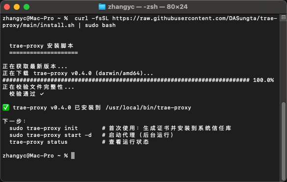

---

## 第二步：初始化配置

> **macOS 提示**：安装证书时系统会弹出密码确认框，输入你的登录密码即可。

运行交互式向导，一次性完成：

```bash
sudo trae-proxy init
```

填写上游服务地址（你的中转站/云服务 API URL）

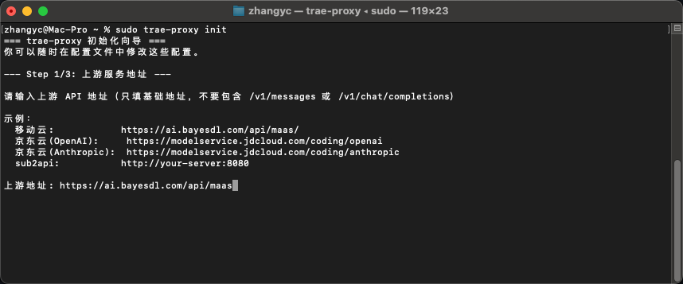

选择协议类型（anthropic / openai）

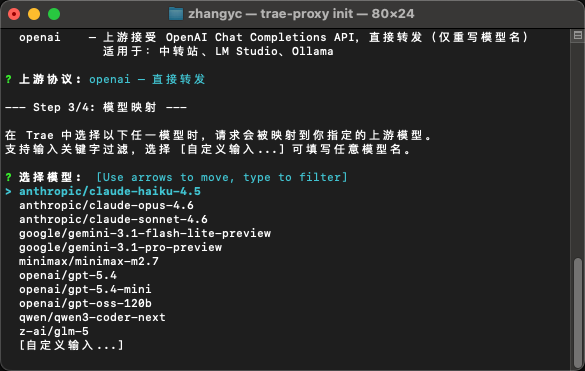

配置模型名映射

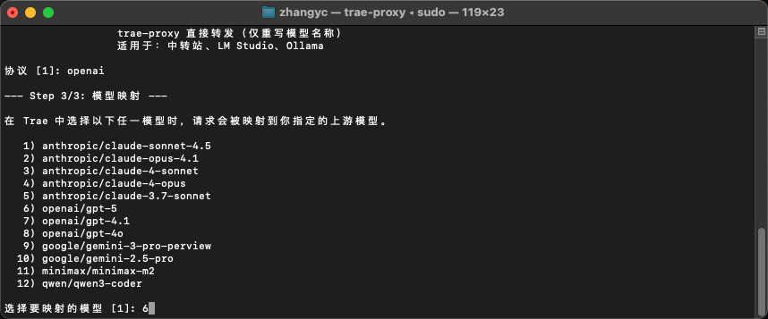

输入映射的实际模型

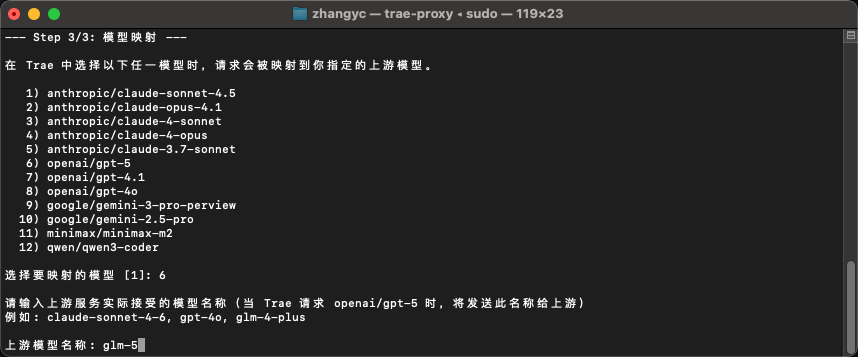

回车确认。配置文件保存在 `~/.config/trae-proxy/config.toml`，可以手动编辑修改。

---

## 第三步：在 Trae 中添加模型

打开 Trae，进入 **设置 → 模型 → 添加模型 → 服务商选择OpenRouter**

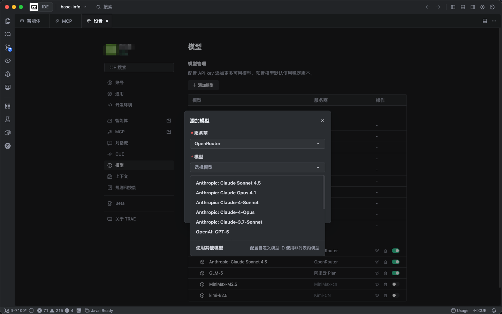

选择刚刚配置中 **选择的模型** ，输入 **上游服务提供的API Key**，确认添加

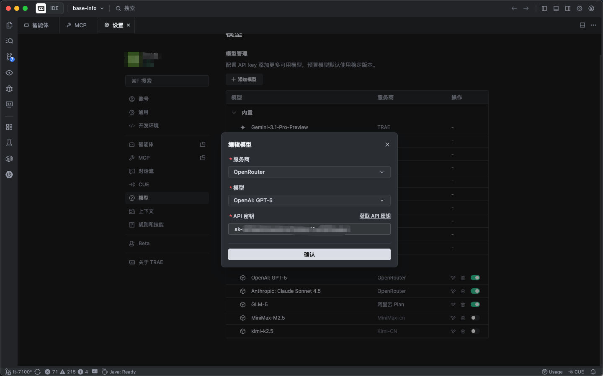

添加后，可以在自定义模型列表中查看

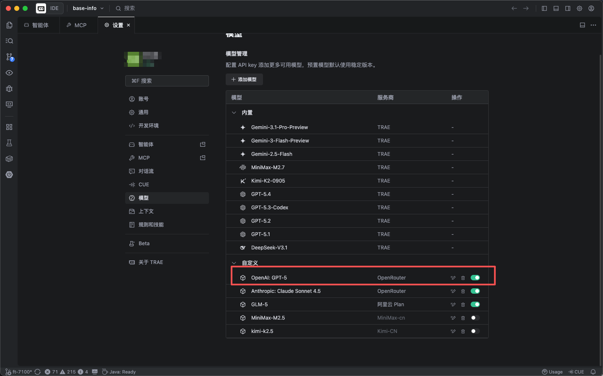

---

## 第四步：启动代理

```bash
# 推荐：后台守护进程模式
sudo trae-proxy start -d

# 查看运行状态
sudo trae-proxy status
```

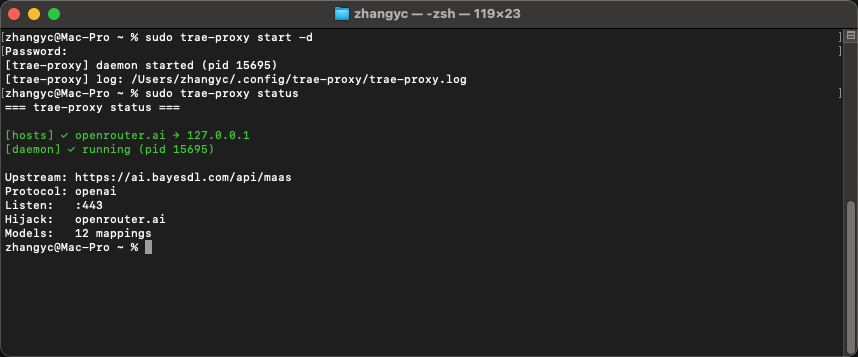

---

## 第五步：验证是否工作

Trae 关闭Auto Mode，选择刚添加的模型

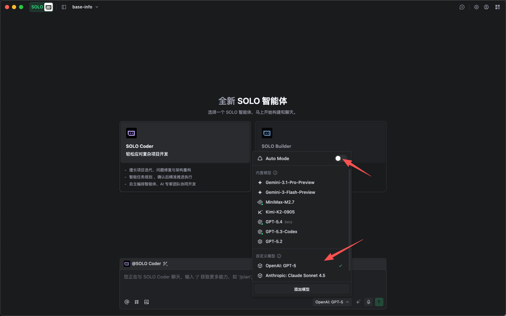

发送一条消息，确认收到回复。

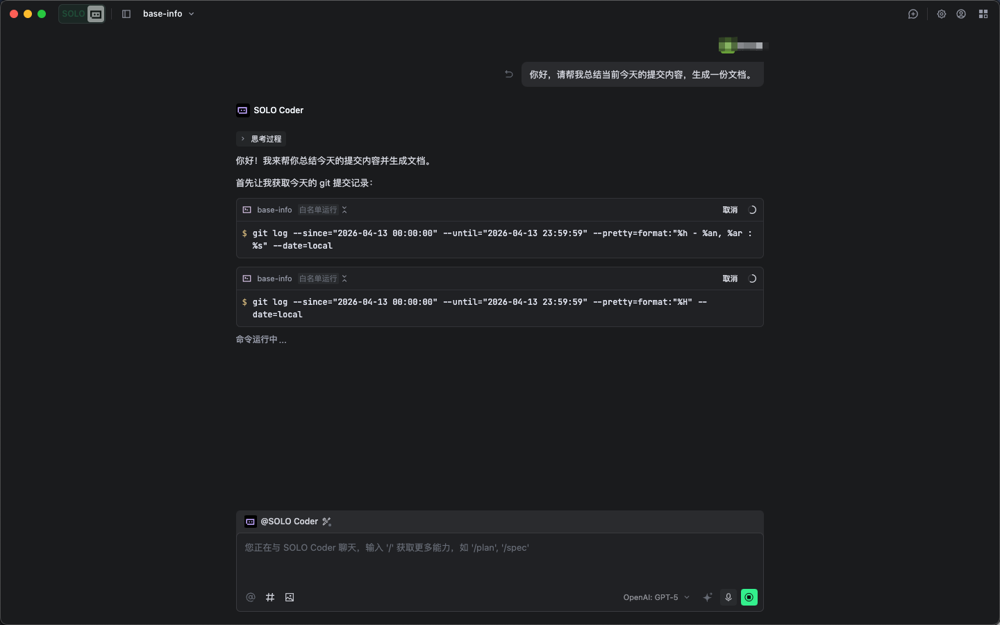

## 遇到问题

**查看实时日志：**

```bash
tail -f ~/.config/trae-proxy/trae-proxy.log
```

---

## 常用操作速查

| 操作     | 命令                          |
|--------|-----------------------------|
| 启动（后台） | `sudo trae-proxy start -d`  |
| 停止     | `sudo trae-proxy stop`      |
| 重启     | `sudo trae-proxy restart`   |
| 查看状态   | `trae-proxy status`         |
| 更新到最新版 | `sudo trae-proxy update`    |
| 卸载并清理  | `sudo trae-proxy uninstall` |

---

## 遇到问题？

**证书不受信任 / 出现安全警告**

重新运行初始化，确认证书安装步骤成功：

```bash
sudo trae-proxy init
```

**Trae 连接失败**

1. 确认代理正在运行：`sudo trae-proxy status`
2. 查看日志排查错误：`tail -50 ~/.config/trae-proxy/trae-proxy.log`
3. 确认上游服务地址可访问

**端口 443 被占用**

查看占用端口的进程：

```bash
sudo lsof -i :443
```

---

完整配置文档、工作原理与高级用法见 [README](../README.md)。

有任何问题，欢迎提 issue。
