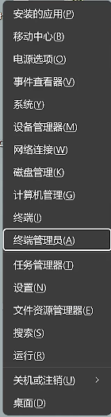

# 快速开始

> 1 分钟内让 Trae 接入自定义 AI 模型。
>
> 完整配置说明见 [README](../README.md)。

---

## 前置要求

- Windows 10/11
- 已有一个支持 **Anthropic Messages API** 或 **OpenAI Chat Completions API** 的上游服务地址

---

## 第一步：一键安装 trae-proxy

在普通用户权限的 PowerShell 中运行：

```powershell
irm https://raw.githubusercontent.com/DASungta/trae-proxy/main/install.ps1 | iex
```

更保守的执行方式（先保存再执行）：

```powershell
irm https://raw.githubusercontent.com/DASungta/trae-proxy/main/install.ps1 -OutFile .\install.ps1
powershell -ExecutionPolicy Bypass -File .\install.ps1
```

脚本会自动：

- 下载最新版本（或使用 `$env:VERSION` 指定版本，如 `$env:VERSION="v0.4.0"`）
- 校验 SHA256 完整性
- 安装到 `%LOCALAPPDATA%\trae-proxy\trae-proxy.exe`
- 将安装目录写入当前用户 PATH

安装脚本本身**不需要管理员权限**。若当前窗口仍提示找不到 `trae-proxy`，请关闭并重新打开 PowerShell。

<details>
<summary>手动安装（备用方案）</summary>

1. 从 [Releases](https://github.com/DASungta/trae-proxy/releases/latest) 页面下载 `trae-proxy-windows-amd64.exe`
2. 重命名为 `trae-proxy.exe`，放到任意目录（如 `C:\tools\`）
3. 将该目录添加到用户 `PATH` 环境变量

</details>

## 第二步：初始化配置



所有命令需在**管理员身份的 PowerShell** 中运行（开始 → 右键 → 以管理员身份运行）。

```bash
trae-proxy init
```

填写上游服务地址（你的中转站/云服务 API URL）


选择协议类型（anthropic / openai）


配置模型名映射


输入映射的实际模型

回车确认。配置文件保存在 `~/.config/trae-proxy/config.toml`，可以手动编辑修改。

---

## 第三步：启动代理

```bash
# 推荐：后台守护进程模式
trae-proxy start -d

# 查看运行状态
trae-proxy status
```


---

## 第四步：在 Trae 中添加模型

打开 Trae，进入 **设置 → 模型 → 添加模型 → 服务商选择OpenRouter**


选择刚刚配置中 **选择的模型** ，输入 **上游服务提供的API Key**，确认添加


添加后，可以在自定义模型列表中查看


---

## 第五步：验证是否工作

Trae 关闭Auto Mode，选择刚添加的模型


发送一条消息，确认收到回复。


## 遇到问题

**查看实时日志：**

```bash
tail -f ~/.config/trae-proxy/trae-proxy.log
```

---

## 常用操作速查

| 操作     | 命令                  |
|--------|---------------------|
| 启动（后台） | `trae-proxy start -d` |
| 停止     | `trae-proxy stop`   |
| 重启     | `trae-proxy restart` |
| 查看状态   | `trae-proxy status` |
| 更新到最新版 | `trae-proxy update` |
| 卸载并清理  | `trae-proxy uninstall` |

---

## 遇到问题？

**证书不受信任 / 出现安全警告**

重新运行初始化，确认证书安装步骤成功：

```bash
trae-proxy init
```

**Trae 连接失败**

1. 确认代理正在运行：`trae-proxy status`
2. 查看日志排查错误：`tail -50 ~/.config/trae-proxy/trae-proxy.log`
3. 确认上游服务地址可访问

---

完整配置文档、工作原理与高级用法见 [README](../README.md)。

有任何问题，欢迎提 issue。
